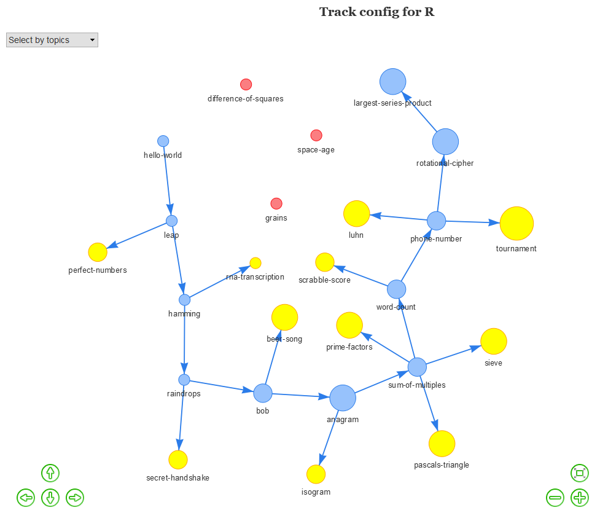

# Track config visualizer for exercism.io

This is a simple Shiny app for visualizing the `config.json` files of language tracks 
on [exercism.io](http://exercism.io/). 

It utilizes `jsonlite` to parse the JSON files and the `visNetwork` package for visualizing 
the progression of exercises as a network path.

It should be accessable via [Shinyapps.io](https://jonmcalder.shinyapps.io/exercism-config-viz/), 
provided that I haven't reached my usage quota.



## Setup/Install

To run it locally, clone this repo and make sure you have installed [R](https://cran.r-project.org/) and [RStudio](https://www.rstudio.com/) as well as the following R packages:

- shiny
- jsonlite
- dplyr
- visNetwork
- shinycssloaders
  
```
install.packages("shiny")
install.packages("jsonlite")
install.packages("dplyr")
install.packages("visNetwork")
install.packages("shinycssloaders")
```

Then simply open up the project/directory in RStudio and run `shiny::runApp()`.

## Contributing

Please feel free to open an issue or pull request if you encounter problems or would like to contribute fixes/improvements etc.
